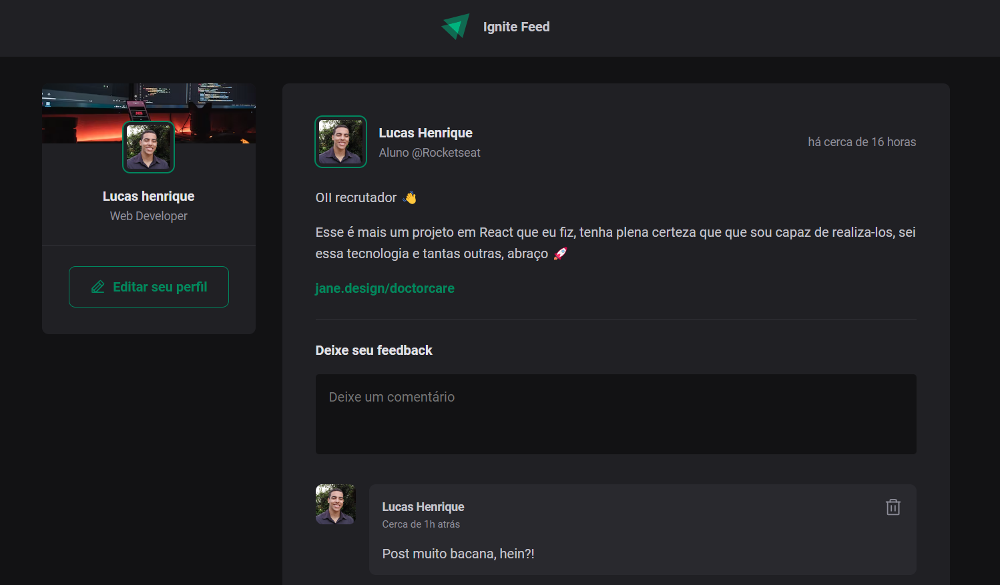
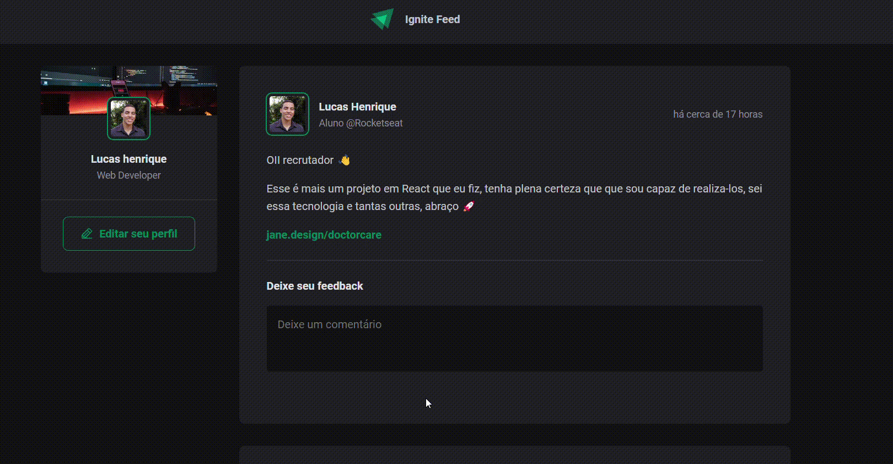

# Ignite Feed

<strong>Ignite Feed</strong> É uma aplicação desenvolvida em ReactJS para web que simula um feed de notícias de uma rede social. Trata-se de um projeto Front End onde o objetivo é treinar as habilidades de comunicação de componentes e estilização da página. 

    

<h2 > <strong>Funções da aplicação:</strong> </h2>
As funções apresentadas são todas contruídas em cima das tecnologias do front end, sendo elas:

<ul>
    <li>Escrever comentários</li>
    <li>Apagar comentários</li>
    <li>Aplaudir comentários</li>
    <li>Determinar o horário que a publicação foi realizada</li>
</ul> 

    

